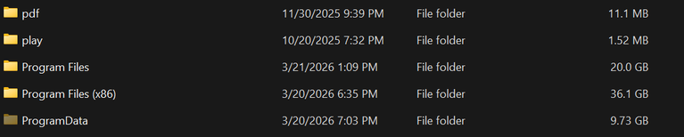
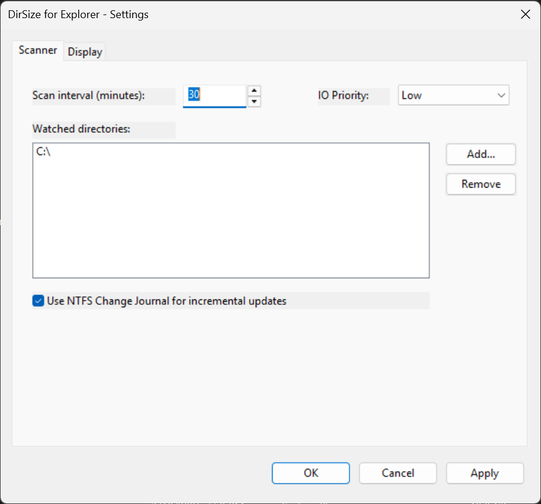
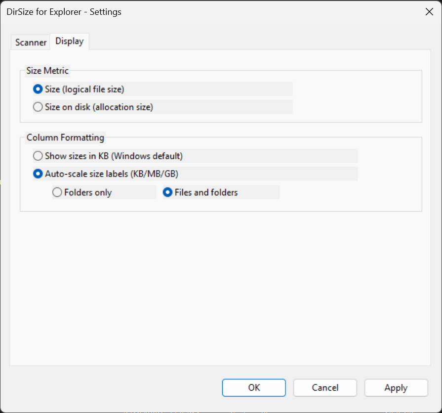

# DirSize for Explorer

A Windows shell extension that displays **directory sizes** directly in Explorer's built-in **Size** column — no extra columns, no third-party file managers.

  



## How It Works

Windows Explorer normally leaves the Size column blank for folders. DirSize hooks into Explorer's rendering pipeline using [Microsoft Detours](https://github.com/microsoft/Detours) to fill in calculated directory sizes — transparently, with no UI changes to Explorer itself.

**Three-layer hook architecture:**

1. **NtQueryDirectoryFile** — injects size data into NT-level directory listings so Explorer sees folder sizes during file enumeration
2. **IPropertyStore::GetValue** — intercepts property queries for directories and returns cached sizes from the database
3. **IPropertyDescription::FormatForDisplay** — optionally auto-scales display formatting (KB → MB → GB) instead of Explorer's default KB-only display

The hooks are installed **only inside `explorer.exe`**. The shell DLL also gets loaded into other applications (e.g. via common file dialogs), but those processes are never patched — every other program continues to see real filesystem data.

A scan engine hosted by the system tray app handles the actual scanning and caches results in a per-user SQLite database. The engine runs in your session (not as a service), so mapped network drives and your share credentials work naturally.

## Features

- **Directory sizes in the Size column** — works in Details view, no extra columns needed
- **Network drive support** — scans mapped drives and UNC paths with your credentials; drive letters are resolved to stable UNC paths automatically
- **Background scanning** — interval scans with low IO priority, run from your session
- **Real-time change watching** — `ReadDirectoryChangesW`-based watchers detect changes on any filesystem that supports change notifications (local disks, SMB shares); changed folders get a cheap single-level rescan and the size delta is propagated to parent folders instantly
- **Size metrics** — choose between "Size" (logical) or "Size on disk" (cluster-rounded allocation)
- **Auto-scale formatting** — optionally show sizes as KB/MB/GB instead of Explorer's KB-only default
- **Configurable scope** — apply auto-scaling to folders only or files + folders
- **System tray settings app** — configure everything from a tabbed settings dialog
- **Low system impact** — configurable IO priority, batched database writes, in-memory LRU cache

## Installation

1. Download `DirSizeForExplorer.msi` from the [latest release](https://github.com/ducky0518/dir-size-for-explorer/releases/latest)
2. Run the installer (requires admin for shell extension registration)
3. Explorer restarts automatically to load the extension
4. Open **DirSize Settings** from the system tray or Start Menu to add watched directories (local folders, mapped drives, or UNC paths)

### Requirements

- Windows 10 or 11 (x64)
- No VC++ redistributable needed — binaries are statically linked
- Real-time updates require a filesystem that supports change notifications (local disks and most SMB servers/NAS do); otherwise interval scans are used

## Configuration

All settings are accessible from the **DirSize Settings** tray app. Two tabs:

### Scanner Tab



| Setting | Default | Description |
|---------|---------|-------------|
| Scan Interval | 30 min | How often to run a full scan (1–1440 minutes) |
| IO Priority | Low | Scanner disk priority: Very Low, Low, or Normal |
| Watched Directories | — | Root directories to scan (mapped drive letters are stored as UNC paths) |
| Excluded Directories | — | Directories to skip entirely: not scanned and not counted in any parent's total |
| Watch for changes | On | Real-time change watching for incremental updates |
| Follow renames | On | When a watched folder is renamed/moved, the config and all cached sizes follow it automatically |

### Display Tab



| Setting | Default | Description |
|---------|---------|-------------|
| Size Metric | Logical Size | "Size" (sum of file sizes) or "Size on disk" (cluster-rounded) |
| Column Formatting | Explorer Default | Explorer's native KB display, or auto-scaled KB/MB/GB |
| Auto-scale Scope | Folders only | Apply auto-scaling to folders only, or files + folders |

Settings are stored per user in the registry at `HKCU\SOFTWARE\DirSizeForExplorer` (machine-wide defaults installed under the same key in HKLM) and take effect within 30 seconds (no restart needed). Saving settings never requires elevation, and one user's settings cannot affect another user's scan engine.

## Architecture

```
┌─────────────────────────────────────────────────────┐
│                   Windows Explorer                   │
│                                                      │
│  NtQueryDirectoryFile ──► IPropertyStore::GetValue   │
│          │                        │                  │
│          ▼                        ▼                  │
│  ┌─────────────────────────────────────┐             │
│  │     DirSizeShellExt.dll (hooks)     │             │
│  │  ┌───────────┐  ┌────────────────┐  │             │
│  │  │ Size Cache│  │ Format Hook    │  │             │
│  │  │ (10k, 60s)│  │ (auto-scale)   │  │             │
│  │  └─────┬─────┘  └────────────────┘  │             │
│  └────────┼────────────────────────────┘             │
└───────────┼──────────────────────────────────────────┘
            │ read-only                 ▲ IPC (named pipe,
   ┌────────▼────────┐                  │  per session)
   │   SQLite DB      │     ┌───────────┴──────────────┐
   │  (dirsize.db)    │◄────│     DirSizeTray.exe      │
   │  %LocalAppData%  │     │  (user session, at logon) │
   └──────────────────┘     │                          │
                            │  Settings GUI            │
                            │  Scan engine:            │
                            │   • interval full scans  │
                            │   • change watchers      │
                            │     (ReadDirectoryChanges)│
                            └──────────────────────────┘
```

Everything runs as the logged-on user: the shell extension inside Explorer, and the scan engine inside the tray app. That's what makes mapped network drives and per-user share credentials work without any configuration, and it means the database, cache, and IPC pipe are all naturally per-user.

### Components

| Component | Description |
|-----------|-------------|
| **DirSizeShellExt.dll** | Shell extension loaded into Explorer — hooks APIs via Detours, reads cached sizes from SQLite |
| **DirSizeTray.exe** | Tray app hosting the scan engine (scanner, change watchers, IPC server) plus the settings GUI |
| **DirSizeEngine.lib** | Scan engine — recursive scanner, IO throttling, directory watchers, IPC server, log buffer |
| **DirSizeCommon.lib** | Shared library — config, database, IPC protocol, path canonicalization, GUIDs |

## Building from Source

### Prerequisites

- **Visual Studio 2022 or later** (or Build Tools) with C++ desktop workload
- **CMake 3.24+**
- **vcpkg** — either standalone with `VCPKG_ROOT` set, or the vcpkg
  component bundled with Visual Studio (`build-installer.cmd` finds it
  automatically). Dependencies build against the `x64-windows-static`
  triplet (static CRT — the MSI ships no runtime DLLs).

### Dependencies

Managed via `vcpkg.json`:
- [sqlite3](https://www.sqlite.org/) — size cache database
- [Microsoft Detours](https://github.com/microsoft/Detours) — API hooking

### Build Steps

```powershell
# Clone
git clone https://github.com/ducky0518/dir-size-for-explorer.git
cd dir-size-for-explorer

# One-time: install the WiX v4+ CLI (requires .NET SDK)
dotnet tool install --global wix

# Build Release binaries + MSI in one step:
.\build-installer.cmd
```

The script configures CMake (requires `VCPKG_ROOT` set), builds Release,
stages the binaries, and produces `build\DirSizeForExplorer.msi`.

```powershell
# Or manually, without the installer:
cmake --preset default
cmake --build build --config Release
```

### Build Presets

| Preset | Config | Description |
|--------|--------|-------------|
| `default` | Release | Optimized build |
| `debug` | Debug | Debug symbols, assertions |

## Uninstalling

Use **Add/Remove Programs** (Settings → Apps) or run:

```powershell
msiexec /x DirSizeForExplorer.msi
```

The installer handles COM unregistration, property schema cleanup, and Explorer restart. The per-user database (`%LocalAppData%\DirSizeForExplorer`) can be deleted manually if desired.

## How It's Different

| Approach | Drawback |
|----------|----------|
| TreeSize / WinDirStat | Separate app, not integrated into Explorer |
| Folder Size (column handler) | Adds a custom column — not the native Size column |
| Explorer++ / Directory Opus | Replaces Explorer entirely |
| **DirSize for Explorer** | **Fills in Explorer's own Size column, zero UI changes** |

## License

[MIT](LICENSE)

## Acknowledgments

- [Microsoft Detours](https://github.com/microsoft/Detours) — inline API hooking library
- [SQLite](https://www.sqlite.org/) — embedded database engine
- [WiX Toolset](https://wixtoolset.org/) — MSI installer framework
